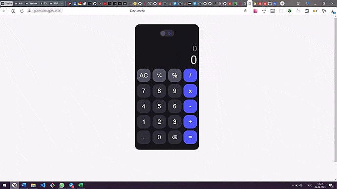

## ***Математический кнопочный калькулятор***

~~~~~~~~~~

~~~~~~~~~~

### ***Стэк***:
* CSS
* HTML
* JavaScript

### ***Реализованно***:
* переключение темы: светлая - темная
* базовые математические операции: сложение, вычитание, умножение, деление, операции с %
* результат операций округляется до сотых
* удаление последнего введенного символа

### ***Еще предстоит сделать***:
* изменение знака +/-
* возможность выводить большие числа

### Ссылки:
* :computer: [Открыть проект](https://gutmalina.github.io/calculator)
